Collections

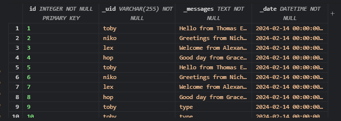

 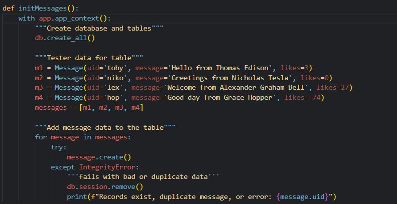   
The first image is of our SQLITE database. The table displayes the user, their details and the messages.

Lists and Dictionaries

This image is from the user query function which will query all the users using a get request. It returns the users and each user item will have information

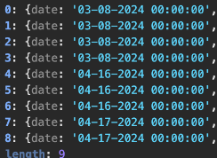
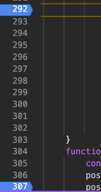

API and JSON

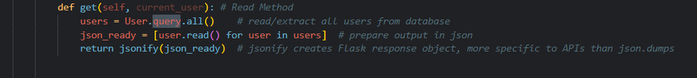
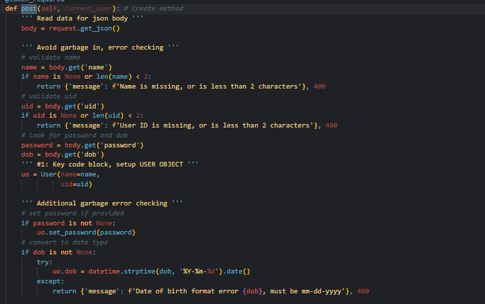
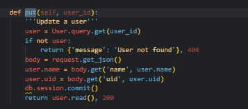
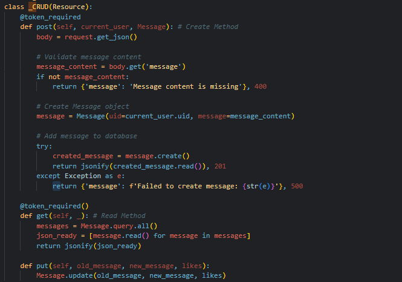

The first image is the get request and this will get the users from the database, prepares the output in JSON, and returns it.

The post request using self is for reading the user and for creating the user. It sets the UID and sets the email while checking if either field is valid (long enough and that it’s not missing or faked). And then it adds it to the database. This is also an example of data validation because it’s ensuring that the email and username are valid.

The update method allows you to add likes or dislikes to the video. It will update the database based on the id type.

Postman Stuff

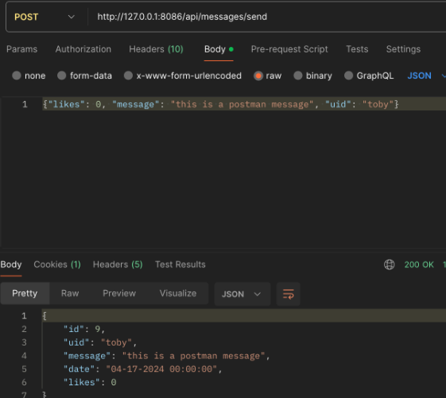

These are each of the requests and the 200 returns are below:

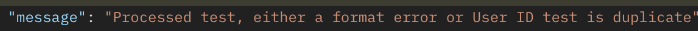

This is the JSON response for a missing body on the post request.

This is the 404 error for a PUT:

Frontend
These are the JSON returns for each request. It also shows the request in the network tab to the right.

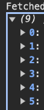

The following is the get request which is formatted. It is displayed in a table format.

This code is what is behind the GET request and obtains the array of objects. It will fetch every user and will use JSON to display them in the users table. This code also does iteration to append each element.

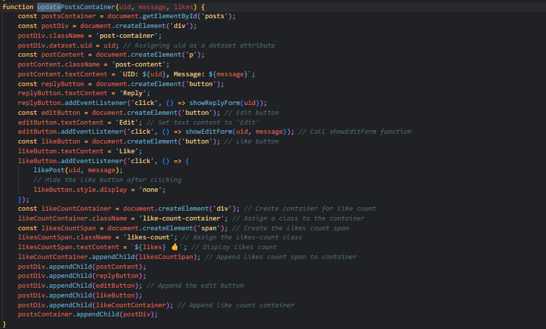

In the Chrome browser, show a demo (POST or UPDATE) gathering and sending input and receiving a response that show update. Repeat this demo showing both success and failure

In JavaScript code, show code that performs iteration and formatting of data into HTML.
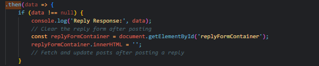

In JavaScript code, show and describe code that handles failure. Describe how the code shows failure to the user in the Chrome Browser screen.
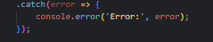